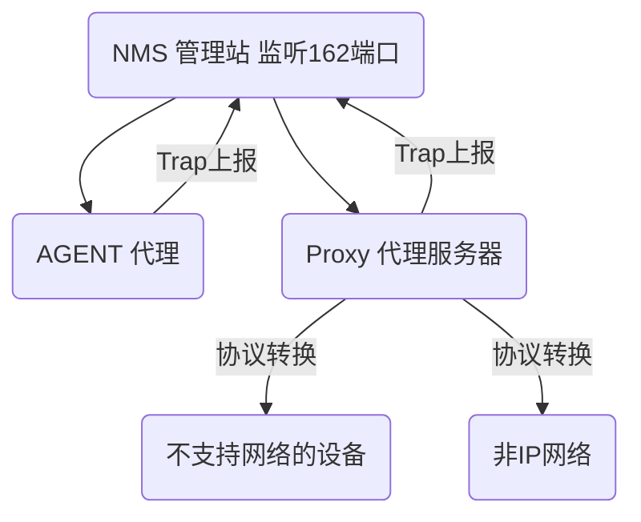
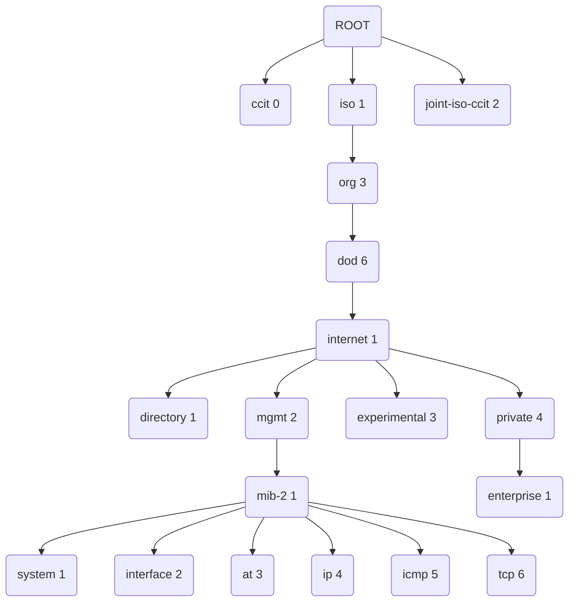

# SNMP协议梳理

## 1.SNMP基本知识介绍

- **什么是SNMP**？

  **简单网络管理协议**（SNMP）是一个[互联网标准](https://en.wikipedia.org/wiki/Internet_Standard)协议，用于收集和组织有关[IP](https://en.wikipedia.org/wiki/Internet_Protocol)网络上管理设备的信息，并修改该信息以更改设备行为。通常支持 SNMP 的设备包括电缆调制解调器、路由器、交换机、服务器、工作站、打印机等。 

  

  SNMP使用UDP协议作为传输层协议，UDP是无连接的协议。在运输层使用的是UDP协议，主要是考虑到TCP对系统开销较大，不利于网络管理环境的要求。虽然UDP数据包的传输不可靠，但UDP非常高效，在网络繁忙时照样可以正常工作，当然UDP也有一些不足，如Trap告警有可能无法按时发送到管理进程。

  

  SNMP广泛应用于[网络管理](https://en.wikipedia.org/wiki/Network_management)，用于[网络监控](https://en.wikipedia.org/wiki/Network_monitoring)。SNMP 以变量的形式公开管理数据，这些变量位于[管理信息库](https://en.wikipedia.org/wiki/Management_information_base)（MIB） 中，其中描述了系统状态和配置。然后，可以通过管理应用程序远程查询（在某些情况下，还可以操作这些变量）。

  已开发和部署了三个重要版本的SNMP。SNMPv1 是协议的原始版本。最新版本 SNMPv2c 和 SNMPv3 在性能、灵活性和安全性方面都有所改进。

  **SNMPv1、SNMPv2、SNMPv3的主要不同**

  1. SNMPv1没有提供足够的安全机制,没有提供读取大块数据(GETBULK)的有效机制

  2. SNMPv2提供了读取大数据块的能力,支持分布式系统,没有提供足够的安全机制
  3. SNMPv3最突出的特点就是其安全性。

- 通信架构

  SNMP协议采用C/S架构，定义了三种角色：SNMP管理，SNMP代理agent和代理proxy服务器。SNMP管理作为客户端，agent和proxy作为服务端。

  由NMS 管理站(通常称为客户端)对Agent和Proxy代理服务器发起请求,对于某些不支持网络或者不是IP网络的设备。如果要通过SNMP协议进行管理的话则需要通过Proxy代理服务器实现协议的转换。

  Agent和Proxy作为服务端工作在161端口，NMS在某些情况下需要监听162端口接收来自Agent和Proxy的Trap告警。

## 2.SNMP系统组成

一套完整的SNMP系统主要包括管理信息库（MIB）、管理信息结构（SMI）及SNMP报文协议。

- 管理信息库MIB

  SNMP管理和Agent的沟通桥梁。MIB是资源和对象标识符oid（object identifier）之间唯一对应关系的数据库。任何一个被管理的资源都可以用oid来对应。每个SNMP设备（Agent）都有自己的MIB，SNMP Agent必须查询MIB库，才能识别SNMP管理的请求。

  

iso.org.dod.internet.mgmt.mib.ip.ipInReceives对应的数字表示为：1.3.6.1.2.1.4.3。比如，设置或获取系统正确运行时间的oid为1.3.6.1.2.1.1.3，更多请查看[SNMP oid列表](https://link.jianshu.com?t=http%3A%2F%2Fwww.cnblogs.com%2Faspx-net%2Fp%2F3554044.html)。

